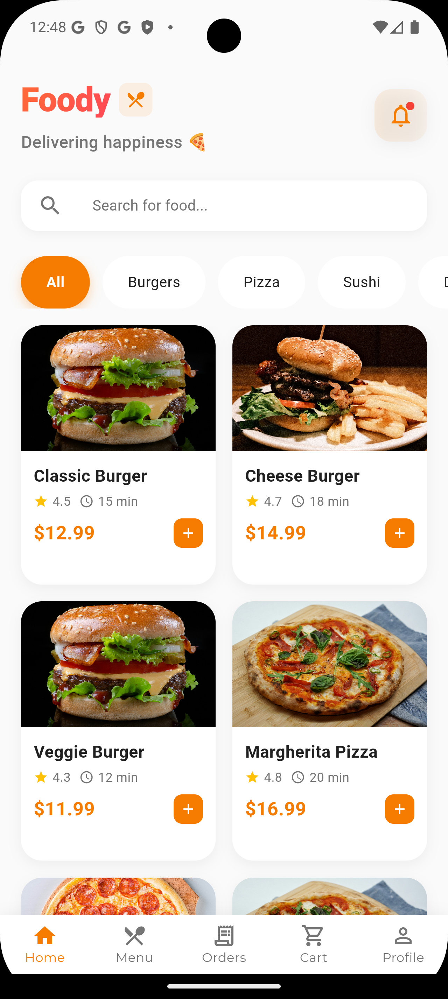
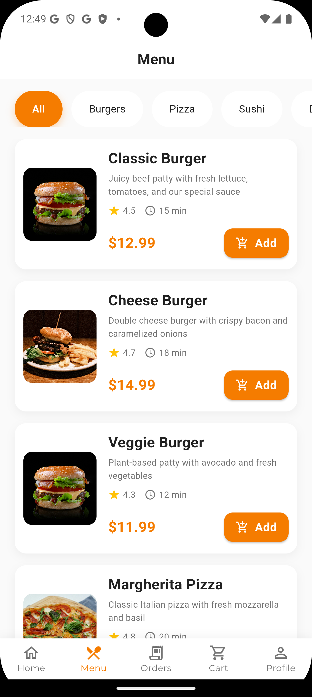
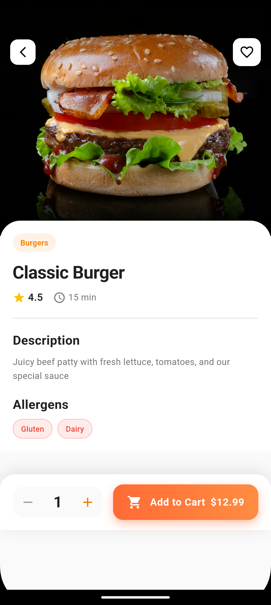

# 🍔 Foody - Food Delivery App

A modern food ordering Flutter application built with BLoC architecture, featuring a complete ordering workflow from browsing menu to order confirmation.

##  Features

- **Browse Menu**: Explore food items across multiple categories (Burgers, Pizza, Sushi, Desserts, Drinks)
- **Search & Filter**: Search for food items and filter by categories
- **Food Details**: View detailed information including allergens, preparation time, and ratings
- **Shopping Cart**: Add/remove items, update quantities, and add special instructions
- **Order Placement**: Complete checkout with delivery address and order confirmation
- **Error Handling**: Comprehensive error handling throughout the workflow
- **Beautiful UI**: Modern, aesthetically pleasing design with smooth animations

## Architecture

This app follows **SOLID principles** and uses **BLoC (Business Logic Component)** pattern for state management:

### Project Structure
```
lib/
├── bloc/
│   ├── cart/              # Cart management BLoC
│   ├── food_menu/         # Menu browsing BLoC
│   └── order/             # Order placement BLoC
├── models/                # Data models
│   ├── cart_item.dart
│   ├── food_item.dart
│   ├── order.dart
│   └── restaurant.dart
├── repositories/          # Data layer
│   ├── food_repository.dart
│   └── order_repository.dart
├── screens/               # UI screens
│   ├── home_screen.dart
│   ├── food_detail_screen.dart
│   ├── cart_screen.dart
│   └── order_confirmation_screen.dart
└── main.dart

test/
└── bloc/                  # Unit tests for BLoCs
    ├── cart_bloc_test.dart
    ├── food_menu_bloc_test.dart
    └── order_bloc_test.dart
```

### SOLID Principles Implementation

- **Single Responsibility**: Each BLoC handles one specific domain (Cart, Menu, Order)
- **Open/Closed**: BLoCs are open for extension through events, closed for modification
- **Liskov Substitution**: All states extend base state classes consistently
- **Interface Segregation**: Repositories expose only necessary methods
- **Dependency Inversion**: BLoCs depend on repository abstractions, not concrete implementations

## 📱 Screenshots

### Home Screen


### menu Screen


### Order Screen


### menu Screen


## Getting Started

### Prerequisites

- Flutter SDK (>=3.4.3 <4.0.0)
- Dart SDK
- Android Studio / VS Code with Flutter extensions

### Installation

1. **Clone the repository**
   ```bash
   git clone <repository-url>
   cd foody
   ```

2. **Install dependencies**
   ```bash
   flutter pub get
   ```

3. **Run the app**
   ```bash
   flutter run
   ```

### Running Tests

```bash
# Run all tests
flutter test

# Run tests with coverage
flutter test --coverage

# Run specific test file
flutter test test/bloc/cart_bloc_test.dart
```

## Workflow

1. **Home Screen**: Browse food items, search, and filter by category
2. **Food Detail**: View item details, select quantity, add special instructions
3. **Cart**: Review items, update quantities, enter delivery address
4. **Order Confirmation**: See order summary and confirmation details

## Testing

The app includes comprehensive unit tests for all BLoCs:

- **Cart BLoC Tests**: Add/remove items, update quantities, calculate totals
- **Food Menu BLoC Tests**: Load menu, filter, search functionality
- **Order BLoC Tests**: Place order, validation, error handling

## Dependencies

```yaml
dependencies:
  flutter_bloc: ^8.1.3      # State management
  equatable: ^2.0.5         # Value equality

dev_dependencies:
  bloc_test: ^9.1.4         # BLoC testing utilities
  mocktail: ^1.0.0          # Mocking framework
  flutter_test: sdk: flutter
```

## Design Highlights

- **Color Scheme**: Orange-based theme for food/appetite appeal
- **Typography**: Clear, readable fonts with proper hierarchy
- **Spacing**: Consistent padding and margins throughout
- **Cards**: Elevated cards with subtle shadows for depth
- **Animations**: Smooth transitions between screens
- **Icons**: Intuitive icons for better UX

## Error Handling

The app handles various error scenarios:

- **Empty Cart**: Prevents placing orders with no items
- **Missing Address**: Validates delivery address before order placement
- **Unavailable Items**: Checks item availability before adding to cart
- **Network Errors**: Simulated network error handling (10% chance)
- **Invalid Quantities**: Prevents invalid quantity updates

## State Management

### BLoC Pattern Benefits

- **Separation of Concerns**: Business logic separated from UI
- **Testability**: Easy to unit test business logic
- **Predictability**: Unidirectional data flow
- **Debugging**: Clear state transitions via BLoC observer
- **Scalability**: Easy to add new features

## Future Enhancements

- Real-time order tracking
- Payment integration
- User authentication
- Order history
- Restaurant ratings and reviews
- Favorites and reorder functionality
- Push notifications
- Multiple delivery addresses

##  License

This project is licensed under the MIT License – see the [LICENSE](LICENSE) file for details.

##  Development

Built with ❤️ using Flutter and BLoC pattern, following best practices and SOLID principles.
